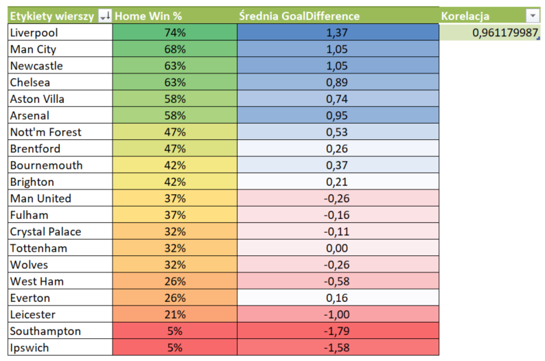

# Football Pivot — Premier League 2024/25


End-to-end mini-pipeline: **Power Query → Excel → SQL**.  

Celem jest odtworzenie i wizualizacja zależności między  

*Goal Difference* a % zwycięstw u siebie (r ≈ 0,96) oraz szybkie wskazanie odstępstw *(outliers)*.


---


## 📁 Struktura repo


| Folder / plik | Zawartość | Jak użyć |
|---------------|-----------|----------|
| `data/raw/`   | oryginalny CSV | zostaw bez zmian |
| `data/clean/` | `E0_2024_clean.csv` (po PQ) | źródło do BULK INSERT |
| `etl/01_clean_E0_2024.m` | kod Power Query | wklej w Excel/Power BI ➜ Puste zapytanie |
| `sql/*.sql`   | skrypty CREATE / BULK / KPI | uruchom w SSMS lub sqlcmd |
| `excel/PremierLeague_2024_Pivot.xlsx` | pivot + formatowanie | UI demo |
| `screenshots/*.png` | podglądy wyników (poniżej) | – |


### Pivot w Excelu


### T-SQL outliers


## 🚀 Szybki start (SQL Server)


```sql
:r sql/createtable.sql
:r sql/bulk insert.sql
:r sql/kpi and outliers.sql
